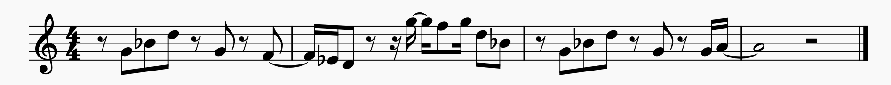
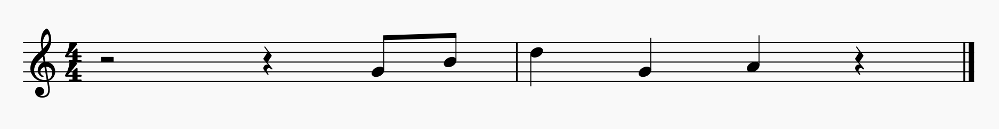
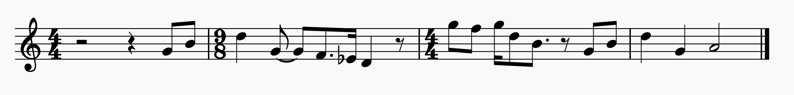

---
title: "Intuitive examples of melodic similarity"
output: rmarkdown::html_vignette
vignette: >
  %\VignetteIndexEntry{Intuitive examples of melodic similarity}
  %\VignetteEngine{knitr::rmarkdown}
  %\VignetteEncoding{UTF-8}
---


```{r, echo = FALSE, message = FALSE, warning = FALSE}

library(dplyr)
library(knitr)
library(musicassessrdocs)
library(musicassessr)

knitr::opts_chunk$set(echo = FALSE)


```

```{r, eval = FALSE}

include_musicassessr_js(record_audio = FALSE, visual_notation = TRUE)

```

In this vignette, we give some examples which show the development of how a participant's performance may change across attempts at singing back the same melody. To illustrate the similarity measurement for different musical dimensions, the following figures show a typical improvement of the sung recalls of one participant on one particular test item.

Participant *F.S.* (male, aged 29, plays bass in rock band) listened to an audio excerpt from the pop song "Cold, Cold Heart" by *Wet Wet Wet*, the vocal melody of which is depicted in Figure 1. 

<!--
```{r, warning = FALSE}

musicassessr::present_stimuli(stimuli = 'https://musicassessr.com/assets/Similarity%201.musicxml',
                              stimuli_type = "musicxml_file",
                              display_modality = "visual")

```

-->


```{r fig.cap = "Figure 1: Transcription of original melody from chorus of “Cold Cold Heart” by Wet Wet Wet", echo = FALSE}



```

Despite the fact that it contains a large jump of one and a half octaves, participants found this melody generally rather easy to reproduce from memory, probably due to its clear phrase structure. Figure 2 shows the recall of *F.S*. after the third listening. 


```{r fig.cap = "Figure 2: Transcription of F.S.’s sung recall of the test item on  the third trial", echo = FALSE}



```

This rendition resembles most to the third (and last) phrase of the original melody. Figure 3 depicts the rendition on the sixth and last trial.

```{r fig.cap = "Figure 3: Transcription of F.S.’s sung recall of the test item on the sixth trial", echo = FALSE}



```


A great improvement in accuracy is clearly visible, although he altered all B flats to B naturals. When reflected by similarity algorithms, this will generally show an increasing score in overall similarity  per trial, though perhaps differing by specific dimension, depending on the type of error made in a particular attempt.

