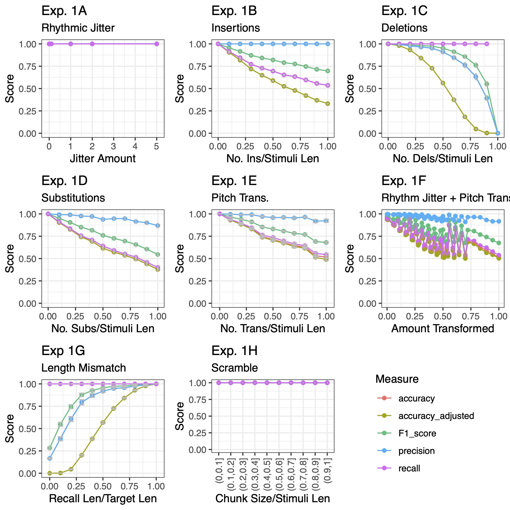
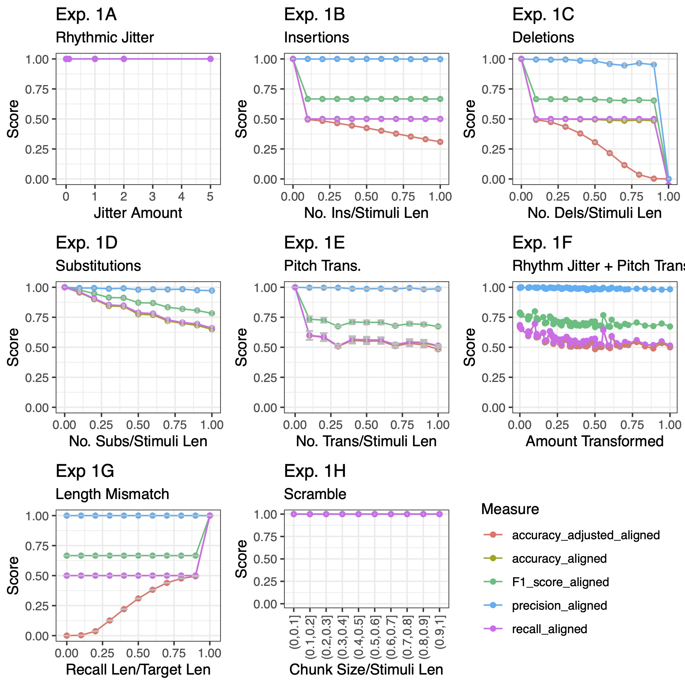

---
title: "Profiling of basic accuracy measures"
output: 
  bookdown::html_document2:
    toc: yes
    toc_depth: 2
    number_sections: FALSE
vignette: >
  %\VignetteIndexEntry{Profiling of basic accuracy measures}
  %\VignetteEngine{knitr::rmarkdown}
  %\VignetteEncoding{UTF-8}
pkgdown:
  as_is: true
---

```{r, echo = FALSE}

knitr::opts_chunk$set(echo = FALSE)

```

In [Silas & Müllensiefen (2023)](https://sebsilas.github.io/musicassessr/articles/white_paper_2_silas_and_mullensiefen_2023.html), we profiled melodic similarity measures against accuracy-based measures on sung recall data (see our [explainer](https://sebsilas.github.io/musicassessr/articles/accuracy_vs_similarity_measures.html) for an explanation of the difference between accuracy and melodic similarity measures). In the paper, we profiled some attempts to comparing a sung recall and its target which were a little bit more sophisticated than basic accuracy measures. For completeness and to show that [basic accuracy measures](https://sebsilas.github.io/musicassessr/articles/accuracy_vs_similarity_measures.html) are completely inadequate for scoring melodic recall data, here we show the same data scored with the more basic forms of accuracy measures. The experiment is described in our paper, with the corresponding results for basic accuracy measures below.

## 1.1 Standard accuracy measure results

As shown in Figure 1, 1A, adding jitter to duration values leaves all basic accuracy measures unaffected. For all other experiments, the measure of *accuracy* never changes as a function of transformations. The other related basic accuracy measures may deteriorate as a function of transformations, depending on the experiment. Notably, scrambling (i.e., changing note orders) affects no measures of accuracy as a function of transformations.


```{r, fig.cap = "Simulation experiment results for non-aligned accuracy measures."}



```


## 1.2 Standard accuracy measure results with alignment

A next step to improving accuracy measures is to look for the best alignment between a sung recall and its target to account for the fact that they may be of different lengths and/or to score a participant benevolently. This can be can be achieved by computing accuracy scores for all possible alignments and taking the highest score. Employing this steps leads to the following, shown in Figure 2: Again, all accuracy measures are unaffected by changes in duration values and scrambling the order of pitches affects no accuracy measures. No accuracy measure has clear monotonic properties across all experiment conditions.

\newpage

```{r, fig.cap = "Simulation experiment results for aligned accuracy measures."}



```


