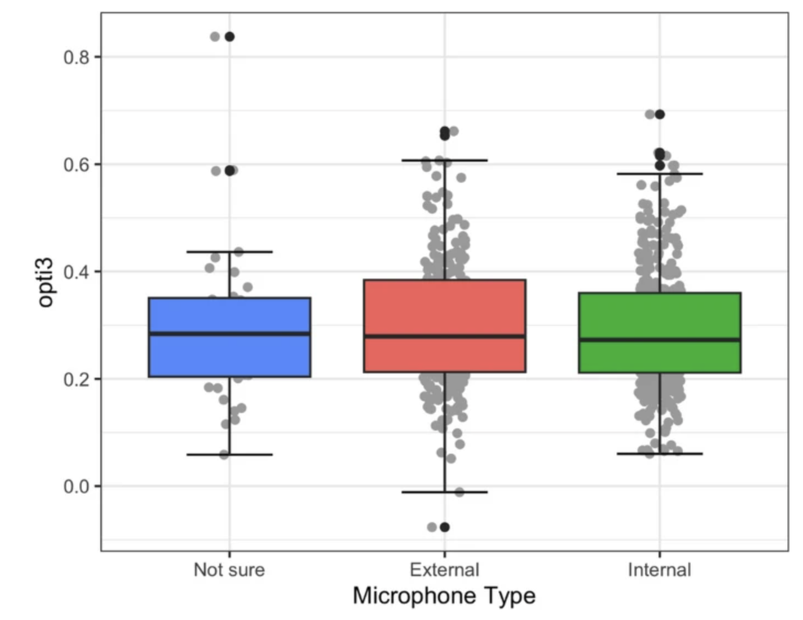

---
title: "musicassessr technical details"
output: rmarkdown::html_vignette
vignette: >
  %\VignetteIndexEntry{musicassessr technical details}
  %\VignetteEngine{knitr::rmarkdown}
  %\VignetteEncoding{UTF-8}
---


# 1. Usage of internal vs. external microphone

When comparing the effect of using an internal vs. external microphone, as self-selected by the user at the beginning of entry to the *SAA* test, the results published in our [Behavior Research Methods paper](https://link.springer.com/article/10.3758/s13428-023-02188-0) (Silas, Müllensiefen, & Kopiez, 2023) suggest there is no difference in *opti3* scores.

A mixed-effects model with microphone type as fixed-effects categorical predictor (*External*, *Internal*, *Not sure*) and participant as a random effect intercept revealed that there was no statistically significant difference in *opti3* scores between the microphone types (*p* < .05). See the table below for model parameters.

This suggest that our audio transcription pipeline is relatively robust, once certain constraints have been fulfilled (e.g., a certain *SNR*).

```{r, fig.cap = "Boxplot, dot plot and SEM plot of opti3 for self-reported microphone type", echo = FALSE}



```


# 2. Signal-to-noise ratio (SNR)

The graphs in Kim et al. (2018) suggest that the transcription accuracy of pitch detection algorithm we use (*pYIN*) starts failing from around a *SNR* < 14. Thus, we use this as the default cutoff for whether a participant can proceed with a test, if their *SNR* is collected before proceeding with the main trial blocks.

# References

Kim, J. W., Salamon, J., Li, P., & Bello, J. P. (2018). Crepe: A Convolutional Representation for Pitch Estimation. 2018 IEEE International Conference on Acoustics, Speech and Signal Processing (ICASSP), 161–165. https://doi.org/10.1109/ICASSP.2018.8461329

Silas, S., Müllensiefen, D., & Kopiez, R. (2023). Singing Ability Assessment: Development and validation of a singing test based on item response theory and a general open-source software environment for singing data. Behaviour Research Methods. https://doi.org/10.3758/s13428-023-02188-0
