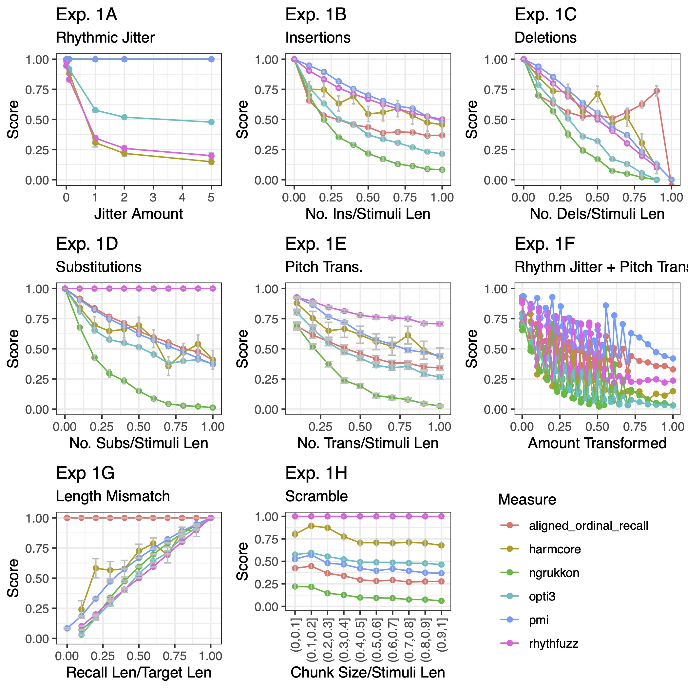
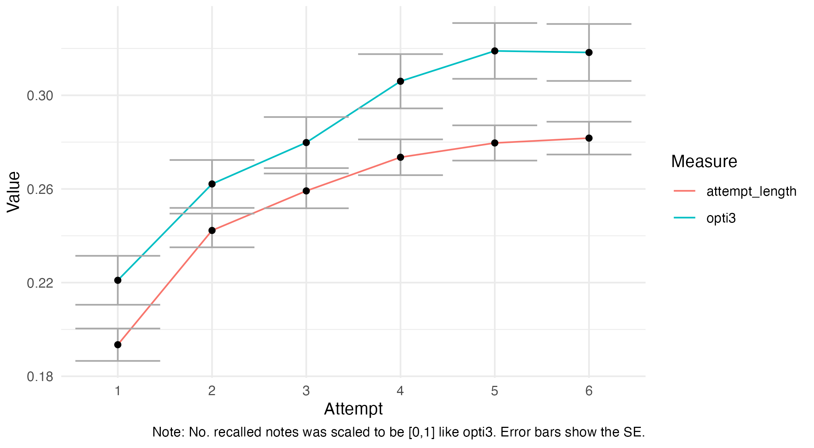
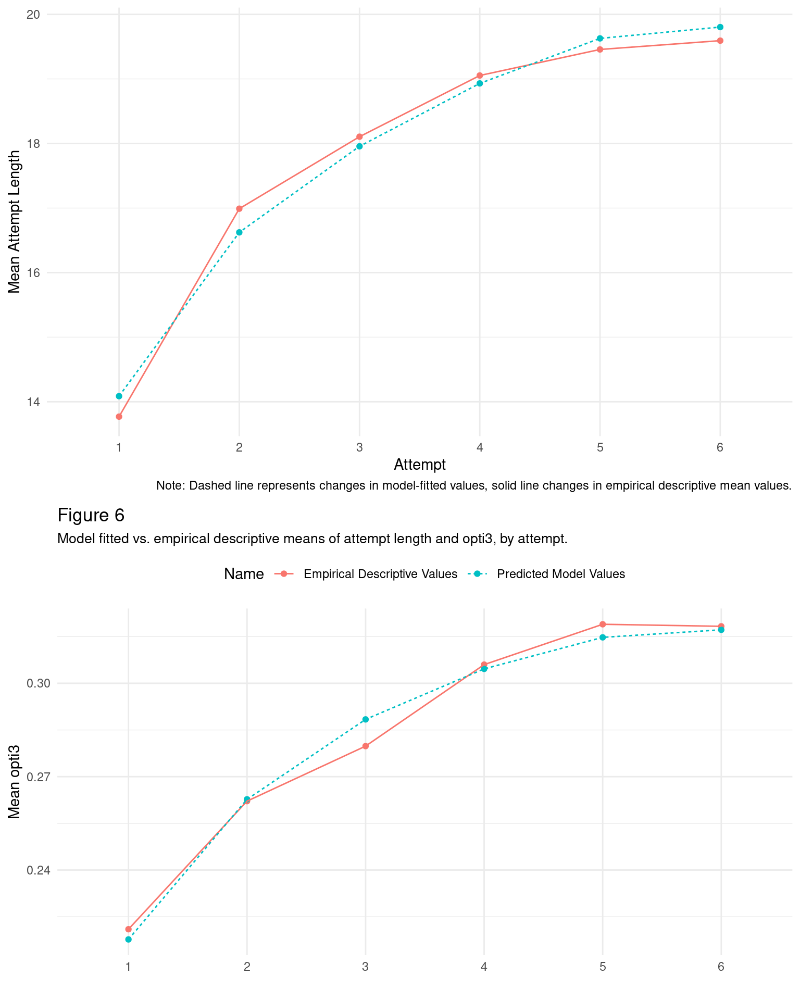
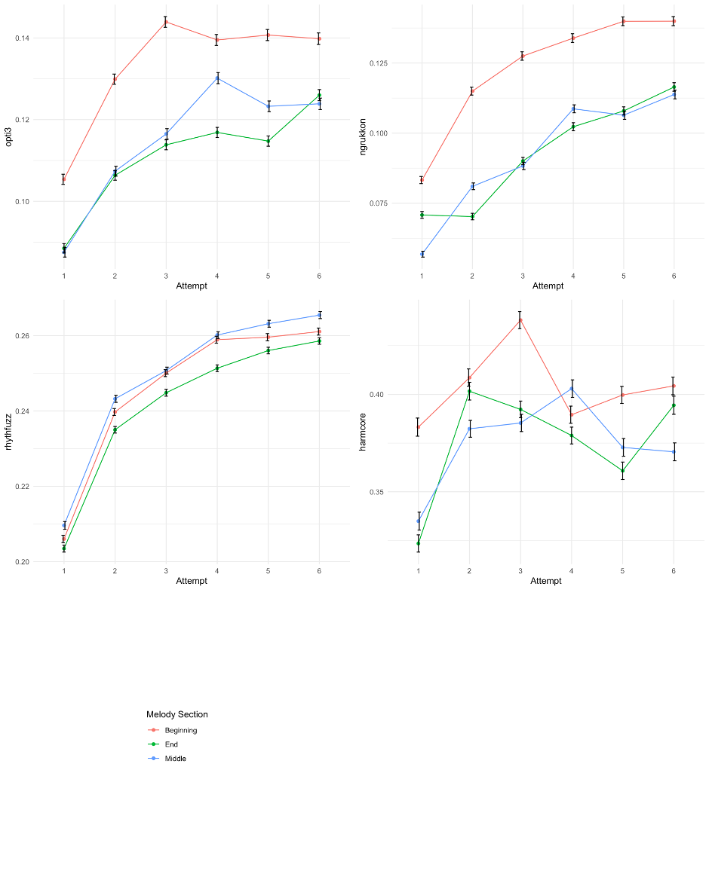
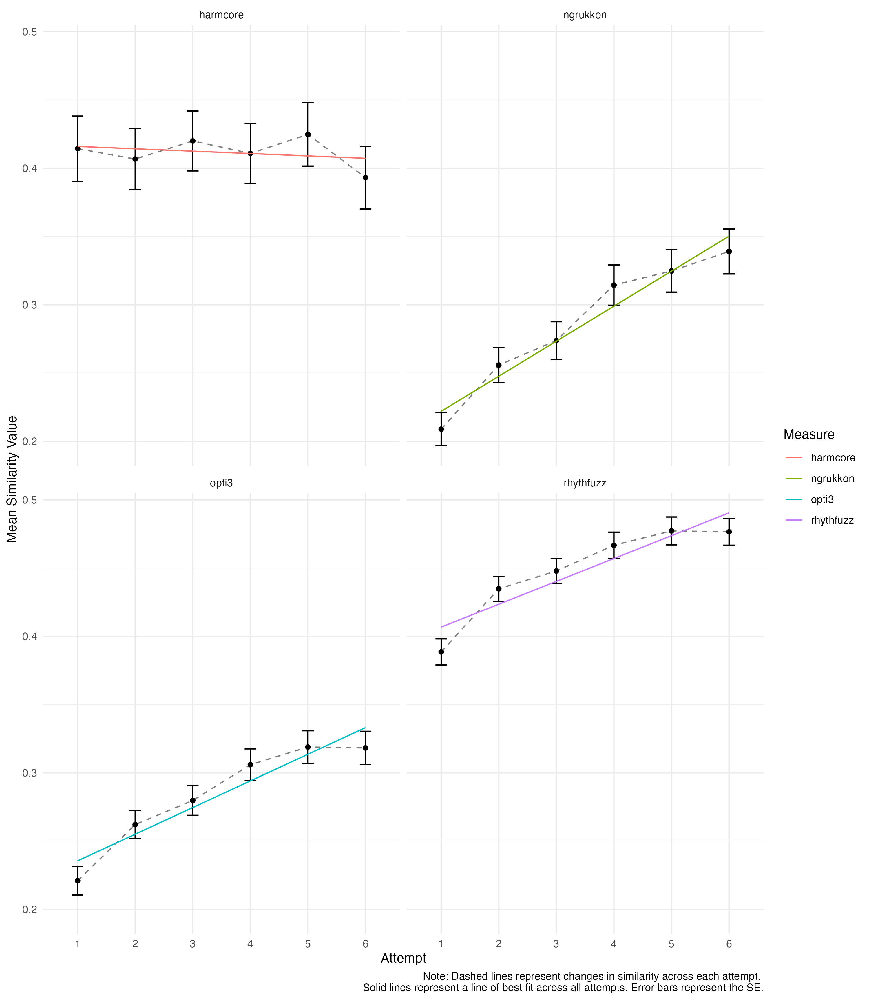
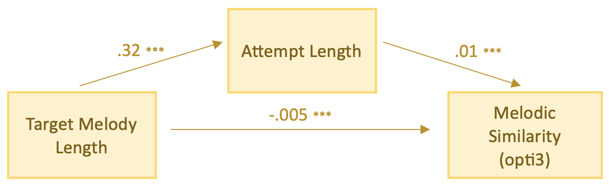

---
title: "Learning and recalling melodies"
output: rmarkdown::html_vignette
vignette: >
  %\VignetteIndexEntry{Learning and recalling melodies)}
  %\VignetteEngine{knitr::rmarkdown}
  %\VignetteEncoding{UTF-8}
---


```{r, echo = FALSE}

knitr::opts_chunk$set(echo = FALSE)

```

# Learning and recalling melodies. A computational investigation using the melodic recall paradigm

## Silas and Müllensiefen (2023)

Here is a high-level summary of the results of:

Silas, S., & Müllensiefen, D. (2023). Learning and recalling melodies: A computational investigation using the melodic recall paradigm. Music Perception.

# Birds-eye view

In this paper, we examined how people learn and recall melodies over multiple attempts. In a first simulation experiment, we reasoned for using similarity measures rather than accuracy-based measures to score how well melodies are recalled. In a second experiment, 31 participants sang back 28 melodies, and the analysis aimed to predict how similar their sung recalls were to the original melodies over multiple attempts.

It was found that, as people try to recall long melodies, their attempts tend to get longer over multiple attempts, and their overall performance improves too. We concluded that when a melody is long enough to require multiple attempts to sing back in full, the main factor determining performance is the length of the target melody. Melodic structure (e.g., tonality, intervals, rhythms) may be more critical for shorter melodies or when dealing with more diverse types of melodies than those used in this study.


## Experiment 1: Similarity Measures as a Methodological Advance for Scoring Melodic Recall Data

Different algorithmic measures were used to assess how well people recall and sing melodies. Specifically, we profiled measures related to the notion of "accuracy" against measures of melodic similarity. We found that accuracy measures have notable limitations. Measures of melodic similarity measures were preferred because they reward participants for singing more notes - and approaching the true length of the melody. This was not always the case for accuracy measures. 

```{r, fig.cap = "Simulation experiment results for different methods of scoring melodic recall data."}



```

*opti3* (Müllensiefen & Frieler, 2004), a measure of of melodic similarity that considers various musical dimensions beyond pitch and intervals, was argued to be more comprehensive and ecologically valid than accuracy measures. It accounted for a wider range of musical errors and could measure different aspects of musical behaviour simultaneously. We chose *opti3* as the main way to measure how well people remember and sing melodies in Experiment 2 (and in the `musicassessr` framework!).


## Experiment 2: How Do We Learn Melodies? A Melodic Similarity-based Perspective.

We summarise the key results of Experiment 2:

1. Recall of Melodies Improves Over Time: When people try to remember and recall a melody, they tend to start with an incomplete recall on their first attempt. With each subsequent try, they usually add more notes to their recall. This process of recall improves over time, but it often doesn't reach a perfect match with the original melody, even after six attempts.


```{r}



```

2. The Learning Curve Resembles an Exponential Curve: The improvement in recalling melodies follows a curve that resembles an exponential shape. It keeps increasing with each attempt but eventually levels off, usually not reaching the full length of the target melody.


```{r}



```


3. Different Sections of Melodies Are Learned Differently: When people recall melodies, they tend to focus on improving the earlier parts of the melody, performing less well on the later notes they've added more recently. However, when it comes to rhythm, the middle of the melody is remembered better than the earlier or later parts. This resonates with the idea of domain-specific interference in working memory (Jarrold et al., 2011).

```{r, fig.width = 16, fig.height = 16}



```

4. Harmonic Elements May Not Improve Across Attempts: While other aspects like rhythm and intervallic structure improve across recall attempts, harmonic elements may remain stable.


```{r, fig.width = 16, fig.height = 16}



```

5. Melodies Might Be Learned Simultaneously Across Different Musical Dimensions: Instead of remembering different musical features (e.g., tonality, intervals, rhythms) independently, we argued that *perhaps* people tend to build representations of melodies across various aspects simultaneously. This should be more cognitively efficient and reflects the tendency of different melodic features to correlate with one another (Baker, 2021).

6. Individual Differences in Melodic Recall: Some people remember certain melodies better than others, possibly due to prior familiarity with similar melodies or differences in their musical and nonmusical memory skills.


```{r}

knitr::include_graphics('white_paper_2_figure_4.png')

```

7. Longer Melodies Are More Challenging: Longer melodies are more difficult to remember because they require more notes to recall, and this can strain working memory. We suggest that the main challenge in recalling melodies is often the sheer length of the melody itself.

8. Full Audio Representation Helps Memory: Learning melodies from full audio, rather than symbolic representations with simple spectral representations(MIDI), makes them easier to remember. Acoustic features, lyrics, and the human voice may assist memory in recalling melodies.

9. Target Melody Length Affects Sung Recall Performance *Via* The Attempt Length: In a mediation model, we show that longer melodies lead to longer attempts (because longer melodies require more notes to be sung); longer attempts generally result elicit higher melodic similarity scores (because they presumably reflect incidental improvements in recalling the melody across musical dimensions). However, the increased complexity of longer melodies negatively affects melodic similarity scores directly, balancing out the overall bivariate relationship between target melody length and sung recall performance (*opti3*), making it statistically insignificant. This is known as "inconsistent mediation" whereby two opposing effects work against each other.

```{r}



```


# Conclusion

This research suggests that the recall of melodies improves over time and multiple hearings, with the length of the target melody being the main significant factor. Melodic features and musical experience also play a role in memory, but the main challenge is often the sheer number of notes in long melodies. Learning melodies from audio tends to be more effective, and musical expertise can help, but isn't always necessary for better recall.

# References

Baker, D. (2019). Modeling Melodic Dictation. LSU Doctoral Dissertations. https://doi.org/10.31390/gradschool_dissertations.4960

Jarrold, C., Tam, H., Baddeley, A. D., & Harvey, C. E. (2011). How does processing affect storage in working memory tasks? Evidence for both domain-general and domain-specific effects. Journal of Experimental Psychology: Learning, Memory, and Cognition, 37(3), 688–705. https://doi.org/10.1037/a0022527

Müllensiefen, D., & Frieler, K. (2004). Melodic similarity: Approaches and applications. In S. D. Lipscombe, R. Ashley, R. O. Gjerdingen, & P. Webster (Hrsg.), Proceedings of the 8th ICMPC (S. 283–289).
